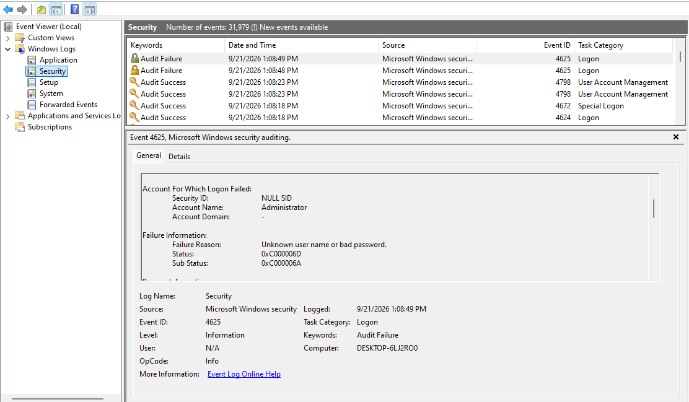
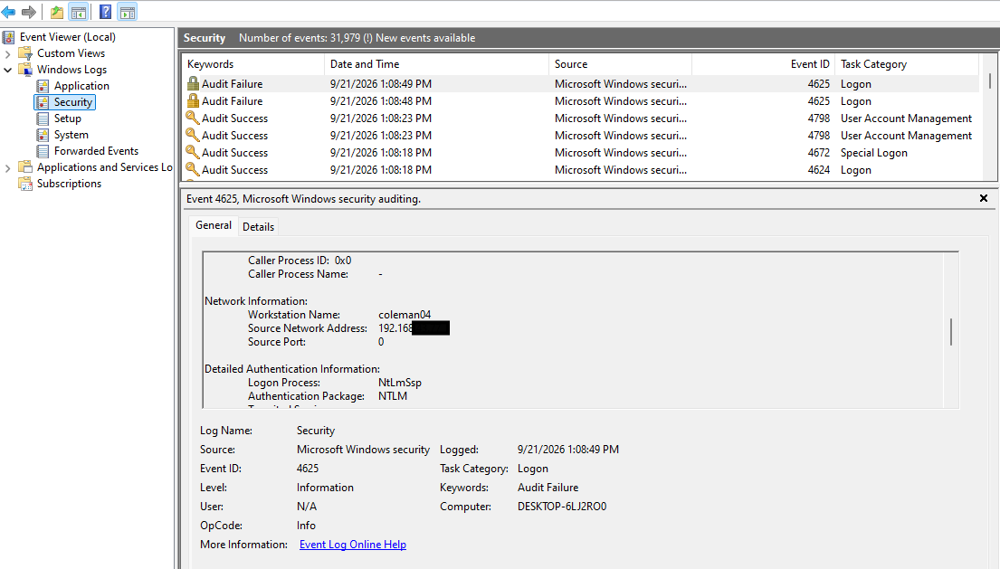
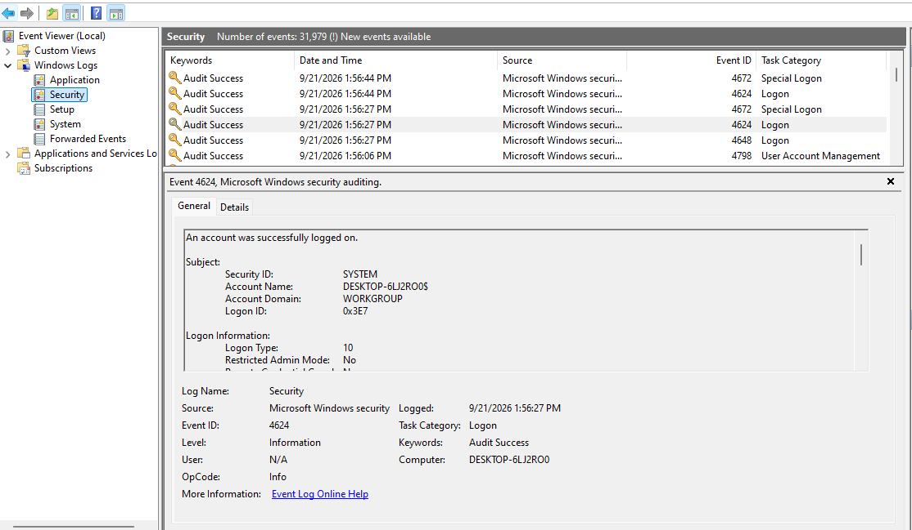
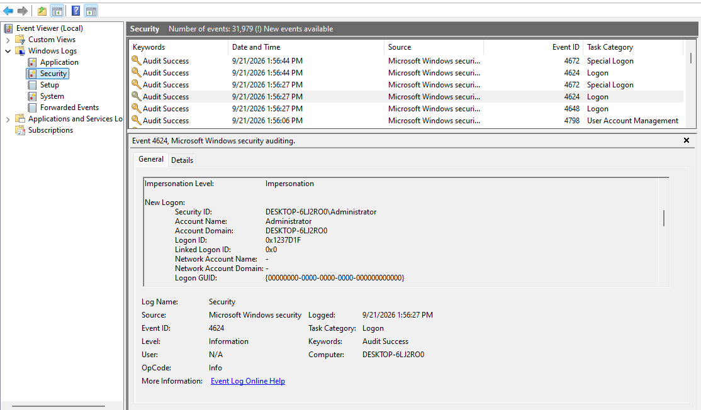
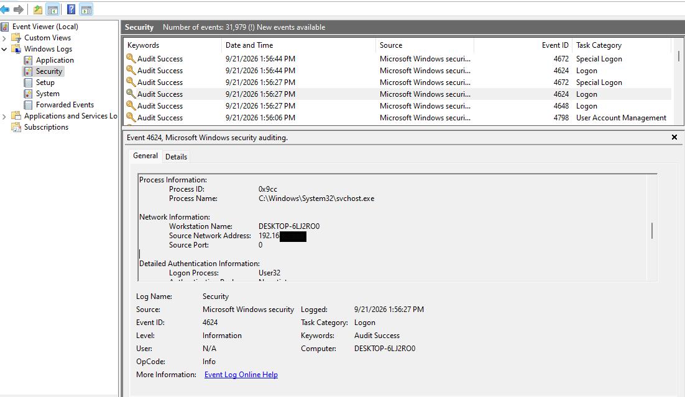
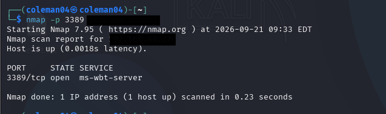
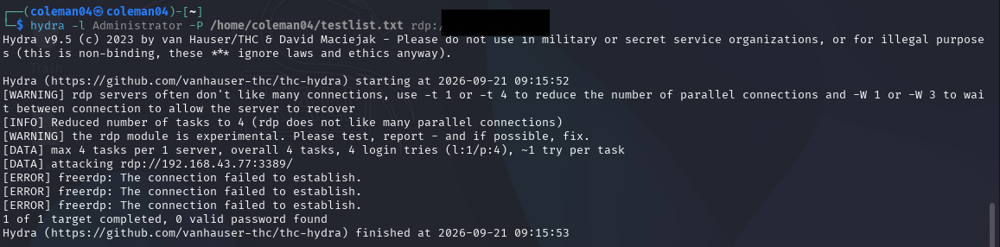
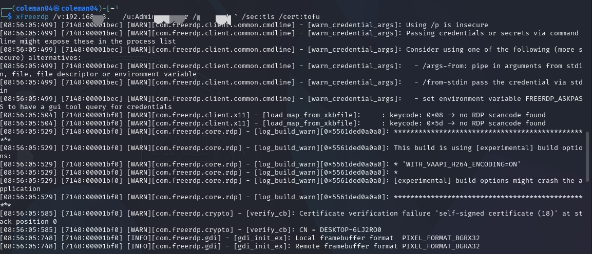
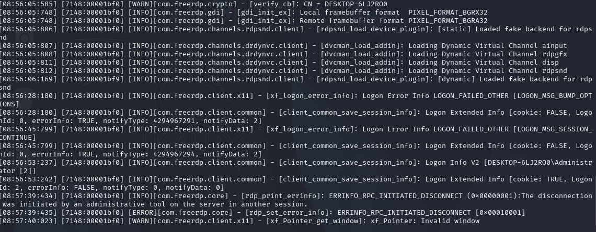

# RDP Brute Force Detection Lab

I set up an exposed RDP server on my own homelab, attacked it, and then dug through Windows' own logs to find the evidence — basically recreating the "Detecting RDP Breach" scenario from a TryHackMe SOC room, but hands-on instead of just reading through it.

---

## Environment

| Component | Details |
|---|---|
| Attacker machine | Kali Linux (VMware Workstation VM) |
| Target machine | Windows 10 Pro (build 22631 / Windows 11-era) |
| Target IP | `192.168.43.xx` |
| Attacker tools | Hydra v9.5, xfreerdp (FreeRDP 3.x) |
| Target account | Local built-in `Administrator` |
| Investigation tools | Windows Event Viewer, `Get-WinEvent` (PowerShell) |

---

## Objective

Recreate the attack chain from the room — a botnet scanning for and brute-forcing an exposed RDP service — on my own two-VM lab, then go find and make sense of the evidence in Windows' native logging myself, rather than just following a walkthrough.

---

## What I Checked

Before I generated any actual attack traffic, I had to make sure the target's RDP exposure was real and working end-to-end:

- **Network reachability** — `ping` and `nmap -p 3389 192.168.43.xx` from Kali to confirm the host was up and what state the port was in
- **RDP service state** — `Get-Service TermService` and its dependencies (`SessionEnv`, `UmRdpService`)
- **RDP enablement flag** — the `fDenyTSConnections` registry value under `HKLM:\System\CurrentControlSet\Control\Terminal Server`
- **Listener binding** — `netstat -an | findstr 3389`, to confirm something was actually bound to the port and not just "configured" on paper
- **Firewall rules** — `Get-NetFirewallRule -DisplayGroup "Remote Desktop"` and `Get-NetFirewallProfile`
- **Account status** — `net user Administrator`, to check whether the target account was even active and eligible for remote logon
- **Security layer negotiation** — RDP Security Layer vs TLS vs NLA (`UserAuthentication` and `SecurityLayer` registry values), which ended up being the thing that decided whether my attack tooling could even complete a handshake

---

## What I Did

1. Enabled RDP on the Windows target (registry flag, firewall rule group, service startup type)
2. Diagnosed and fixed a "port filtered" state that stuck around even though everything looked correctly configured
3. Built a small custom password wordlist instead of running full `rockyou.txt` for a first pass, just to get a fast, readable result
4. Ran Hydra against the target's RDP service
5. Traced a "credential valid but logon refused" result down to the built-in Administrator account being disabled by default, and re-enabled it
6. Traced a follow-up handshake failure to Hydra's RDP module conflicting with Network Level Authentication (NLA)
7. Disabled NLA server-side and confirmed the fix using `xfreerdp` as a more verbose, independent client
8. Successfully authenticated via `xfreerdp` over TLS with NLA off, generating a real interactive RDP session
9. Pulled the resulting authentication events from the Windows Security log and confirmed Logon Type, account name, and source for each

---

## Tools Used

- **Hydra 9.5** — my RDP brute-force attempt, ultimately blocked by its own experimental RDP module's NLA incompatibility. Documented as a known limitation of the tool, not something wrong with my setup.
- **xfreerdp (FreeRDP 3.x)** — ended up being both my working attack/access tool and my main diagnostic client, since its verbose logging actually showed me the TLS/NLA/cert failure points that Hydra's generic error message wouldn't
- **PowerShell** — target-side configuration, service management, and log querying (`Get-WinEvent`, `Get-NetFirewallRule`, `Get-Service`, registry cmdlets)
- **Windows Event Viewer / Security log** — Event ID 4624 (successful logon) and 4625 (failed logon)
- **nmap** — checking port state from the attacker's side

---

## Issues I Ran Into and Fixed

| # | Issue | Root Cause | Fix |
|---|---|---|---|
| 1 | `nmap` reported port 3389 as `filtered` even though the service showed "Running" | `TermService`'s dependencies (`SessionEnv`, `UmRdpService`) were actually stopped, so nothing was bound to the port | Started the dependent services; needed a full reboot to clear an inconsistent service state after a few failed restart attempts |
| 2 | Hydra found the correct password but reported the account "not active for remote desktop" | The built-in `Administrator` account is disabled by default on Windows 10/11 | `net user Administrator /active:yes` |
| 3 | Hydra failed with a generic `[ERROR] freerdp: The connection failed to establish` | NLA (Network Level Authentication) pre-auth handshake incompatibility between Hydra's experimental RDP module and the target's default CredSSP requirement | Disabled NLA server-side (`UserAuthentication = 0`) |
| 4 | `xfreerdp` failed at the NLA stage with `ERRCONNECT_LOGON_FAILURE`, then failed again with a connection reset when I forced legacy `/sec:rdp` | The target's Windows build has fully deprecated the legacy RDP Security Layer; NLA-off doesn't mean legacy-layer support — TLS was the correct fallback | Used `/sec:tls /cert:tofu` instead of `/sec:rdp` |
| 5 | Hydra still failed after all the above fixes were confirmed working via `xfreerdp` | Hydra's RDP module is explicitly labeled "experimental" and has known compatibility gaps with modern Windows RDP stacks | Accepted it as a tooling limitation and validated the attack path with `xfreerdp` instead — a fair substitution for what this exercise was actually testing |

---

## Evidence

I tracked down two Security log events and cross-checked them field by field, rather than just trusting timestamp proximity (see "What I Learned" below for why that mattered).

**Failed logon attempt**

| Field | Value |
|---|---|
| Event ID | 4625 |
| Time | 9/21/2026 1:08:49 PM |
| Logon Type | 3 (Network) |
| Target Account | Administrator |
| Workstation Name | coleman04 |
| Source Network Address | `192.168.43.xx` (redacted in screenshots) |
| Authentication Package | NTLM (NtLmSsp) |
| Failure Reason | Unknown user name or bad password |
| Status / Sub Status | `0xC000006D` / `0xC000006A` |

**Successful logon**

| Field | Value |
|---|---|
| Event ID | 4624 |
| Time | 9/21/2026 1:56:27 PM |
| Logon Type | 10 (RemoteInteractive) |
| Account | Administrator |
| Source Network Address | `192.168.43.xx` (redacted in screenshots) |

**Supporting artifacts**

*Port state check from the attacker side, before any authentication attempts.*

*Hydra's RDP module wouldn't establish a connection even after I disabled NLA server-side — a documented limitation of its experimental RDP support, not something wrong on the target (see Issue #5 above).*

*The attacker-side match to the 4624 event above — `xfreerdp` over TLS with NLA disabled, showing `Logon Info V2 [DESKTOP-6LJ2RO0\Administrator]`. The session got cut a bit later by an admin action on the target (I reset the password from the local console mid-session), logged as `ERRINFO_RPC_INITIATED_DISCONNECT` — not a connection failure.*

---

## What I Accomplished

- Took a Windows host from "RDP fully disabled" to a properly exposed, authenticated-access-capable RDP service, entirely from the command line
- Diagnosed five separate, stacked failure conditions (service dependency, account state, NLA negotiation, security layer mismatch, tool limitation) using log output and error messages instead of guessing
- Generated a real failed logon (Event ID 4625) and a real successful logon (Event ID 4624) against my own infrastructure, confirmed through native Windows Security auditing
- Practiced the actual attacker-to-defender log correlation workflow a SOC analyst uses day to day: source IP, account name, Logon Type, and timestamp correlation between the attacking host and the target's audit trail

### Why this matters for security work

This is basically a compressed version of what a SOC Analyst or DFIR practitioner does regularly: you have an alert or a hypothesis ("this service might be exposed and brute-forceable") and you have to validate it against real, often messy system state, using tools whose error messages don't always point you straight at the root cause. A few things this drove home for me:

- **Detection engineering** — actually knowing what 4625 vs 4624 represents, and what the different Logon Type values mean, is the foundation for writing real SIEM detection rules (e.g., a Splunk/Sysmon correlation search for "N failed 4625s from one source followed by a 4624"), not just knowing the IDs exist on a cheat sheet
- **Troubleshooting under ambiguity** — real intrusions and real lab environments both throw misleading or incomplete error output at you; isolating one variable at a time (network → service → auth protocol → account state) is a skill that transfers straight into incident triage
- **Tool limitations are real findings too** — figuring out that Hydra's RDP module itself was the blocker, not the target, mirrors something analysts genuinely need to recognize: a negative result can mean the tooling has a gap, not that a security control is working as intended. Missing that distinction leads to wrong conclusions in an assessment.

---

## What I Learned

- RDP "being enabled" isn't one toggle — it depends on the service, its dependencies, the firewall rule, the registry flag, the account's active state, *and* the negotiated security protocol (NLA vs TLS vs legacy RDP), all separately
- NLA and the RDP Security Layer are two different settings that are easy to mix up — disabling one doesn't say anything about the other
- The built-in Administrator account is disabled by default on modern Windows, and it's an easy, common thing to overlook in a lab exercise that assumes the account is just usable out of the box
- `xfreerdp`'s verbose logging is a much better diagnostic tool than Hydra's generic error output, even when Hydra is the actual tool I was trying to get working
- Windows Security log queries should use `Get-WinEvent -FilterHashtable` instead of pulling a fixed number of recent events and filtering afterward — the event you actually want can silently fall outside a `-MaxEvents` window as new events pile up
- A 4625 event with the right timestamp and a matching source IP isn't enough on its own to confirm it's RDP-related. I initially grabbed an event with the correct IP but **Logon Type 2** (Interactive/console) — turned out to be an unrelated local logon, not network traffic. Failed RDP attempts actually log as **Logon Type 3** (Network) rather than Type 10, since Windows doesn't assign the RDP-specific session type until authentication actually succeeds — Type 10 only shows up on the successful 4624. Checking Logon Type explicitly, instead of relying on IP and timestamp alone, is what saved me from citing the wrong event as evidence.

---

## What I'd Do Differently Next Time

- Check the built-in Administrator account's active status **before** starting any brute-force attempt — it's a fast, common blocker
- Verify `netstat -an | findstr 3389` right after enabling RDP, before touching firewall/registry settings any further, to catch listener-binding issues earlier
- Use `Get-WinEvent -FilterHashtable` from the very first log query instead of pulling everything and filtering after, to avoid missing events
- Test connectivity with `xfreerdp` *before* touching Hydra — it surfaces protocol-level issues (NLA, TLS, security layer) with much clearer error messages, and would've shortened my troubleshooting path considerably
- Snapshot the target's baseline service/firewall/account state at the start, so I can diff failed-vs-working configs directly instead of re-deriving the root cause from error messages every time

---

*Part of an ongoing SOC Analyst / DFIR homelab portfolio. Related write-ups: Sysmon setup, incident response drills.*

---

**Author:** Coleman04 | Stephen Okegbade O.
